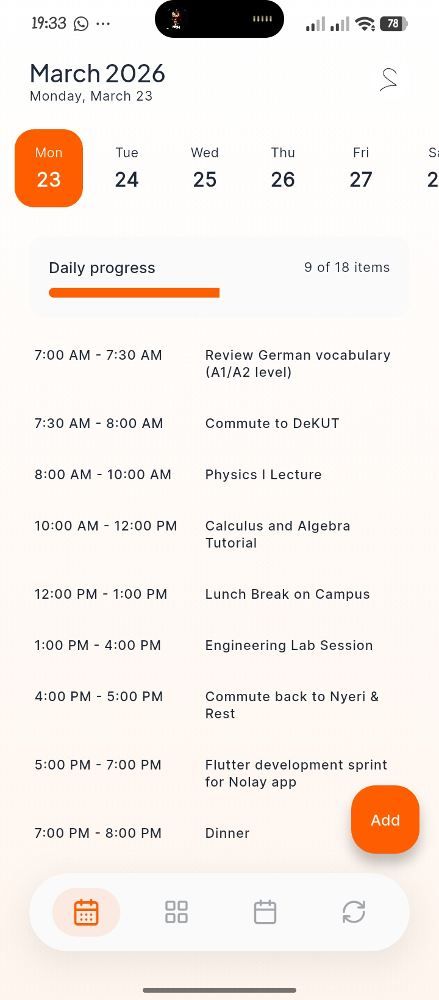
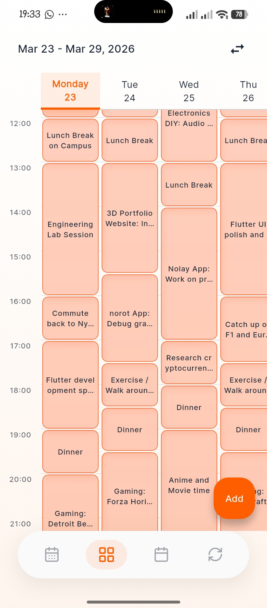
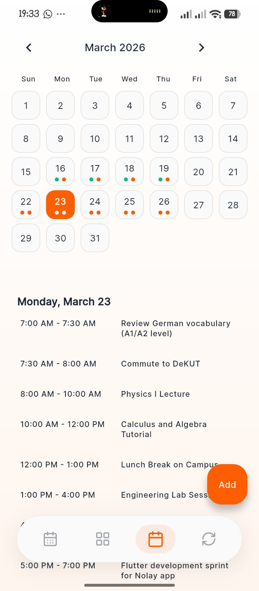

# Nolay 🗓️✌️

A 100% free planner to track tasks & routines across daily, weekly, and monthly views. Data lives locally on your device, with Drive backups so you control it. I added an AI import feature—just bring any free or paid AI you use to format your schedule to save typing while keeping the app free. Just a personal side project, hope it helps! ✌️

## Features (or why I built this)
- **Local-first & Free Backups**: No central servers hoarding your data. Everything lives on your phone and backs up securely to your own Google Drive.
- **Bring Your Own AI**: Instead of me charging you to use an AI API, just paste your schedule into any AI you already use (ChatGPT, Gemini, etc.), hit import, and let Nolay do the rest. 
- **Tasks & Routines**: Time-aware scheduling with repeating frequents. Group them up for projects or classes easily.
- **Flexible Views**: View your schedule daily, weekly, or monthly.
- **Home Screen Widgets**: Quick-glance widgets so you don't even have to open the app.
- **Clean UI**: Custom glassmorphism-style interface with a slick Dark Mode.

---

## � Screenshots
*(Just replace the placeholder links below with the actual paths or URLs to your images when you add them to your repo!)*

| Daily View | Weekly View | Monthly View |
| :---: | :---: | :---: |
|  |  |  |

---

## �📥 Download & Install

Grab the `.apk` from the [Releases](../../releases) tab.

### Which APK should I pick?
* **Nolay-Universal.apk**: The safest choice. It contains everything and works on all devices, but the file size is a bit larger.
* **Nolay-arm64-v8a.apk**: Use this for almost all modern Android phones (from the last 5+ years). Start here!
* **Nolay-arm-v7a.apk**: Choose this if you have an older Android device.
* **Nolay-x86_64.apk**: Choose this if you are using an Android emulator on a PC.

### Install instructions:
1. Download the `.apk` file directly to your phone.
2. Open it to install (your phone might ask you to "Allow installation from unknown sources" in settings).
3. Done! 

---
Feel free to open an issue if you spot a bug or want to suggest something.
